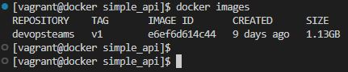
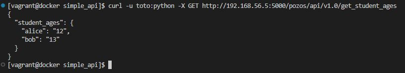
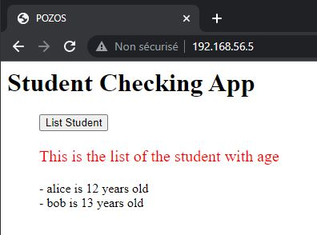

# projet de liste d'étudiants

Veuillez trouver les spécifications en cliquant [ici](https://github.com/diranetafen/student-list.git "ici")

 

------------

Prénom : Nesta

Nom : Kengni Fongang

Pour le 11ème Bootcamp DevOps d'Eazytraining

Période : janvier-Fevrier-mars
dimanche 16 Avril 2023

## Application

J'ai dû déployer une application nommée "*student_list*", qui est très basique et permet à POZOS d'afficher la liste de certains étudiants avec leur âge.

L'application student_list comporte deux modules :

- Le premier module est une API REST (avec authentification de base nécessaire) qui envoie la liste des souhaits de l'étudiant sur la base d'un fichier JSON
- Le deuxième module est une application Web écrite en HTML + PHP qui permet à l'utilisateur final d'obtenir une liste d'étudiants

## Le besoin

Mon travail consistait à :
1) construire un conteneur pour chaque module
2) les faire interagir les uns avec les autres
3) fournir un registre privé

## Mon plan

Tout d'abord, laissez-moi vous présenter les cinq***fichiers*** de ce projet et leur rôle

Ensuite, je vous montrerai comment j'ai ***construit*** et testé l'architecture pour justifier mes choix

La troisième et dernière partie sera sur le point de fournir le processus de *** déploiement *** que je suggère pour cette application.


### Le rôle des fichiers

Dans ma livraison vous pouvez trouver trois fichiers principaux : un ***Dockerfile***, un ***docker-compose.yml*** et un ***docker-compose.registry.yml***

- docker-compose.yml : pour lancer l'application (API et web app)
- simple_api/student_age.py : contient le code source de l'API en python
- simple_api/Dockerfile : pour construire l'image de l'API avec le code source dedans
- simple_api/student_age.json : contient le nom de l'étudiant avec l'âge au format JSON
- index.php : page PHP où l'utilisateur final sera connecté pour interagir avec le service afin de répertorier les étudiants avec leur âge.


# Construire et tester

Considérant que vous venez de cloner ce référentiel, vous devez suivre ces étapes pour préparer l'application 'student_list' :
 ## Build et test
1) Changez de répertoire et création de l'image du conteneur d'api :

```bash
cd ./student-list/simple_api
docker build . -t devopsteams:v1
docker images 
```
> 

2) Création du contenainer et Exécution de la commande curl pour etre sur que l'api répond correctement :

```bash
docker run -- name api -d -p 5000:5000 devopsteams:v1
curl -u toto:python -X GET http://192.168.56.5:5000/pozos/api/v1.0/get_student_ages
```
> 

Notre images étant bien construite et fonctionnelle,nous allons passer à la construction de la recette qui nous permettra de  fournir une IHM (Interface Homme Machine) a notre api et les faires communiqué entre eux  et cela sous formes d’infrastructure en tant que code et la recette obtenue sera ainsi un  ***docker-compose.yml*** .

 # Infrastructure As Code


Apres avoir edité notre recette As code , nous exécutons notre docker-compose file via la commande :
```bash
docker-compose up -d 
```
Nous avons le résultat suivant dans le navigateur :
> 

Notre application est accessible depuis l'extérieur grâce au port 80 donc pour avoir ce résultat au niveau du navigateur nous avons renseigner l'url suivante : https/192.168.56.5:80 .


# Docker Registry 

Apres avoir creer l'images **devopsteam** pour l'entreprise Pozos faudrais bien que l'on puise leur fournir un registre ou ils pourront stocker leurs images docker en toute  Sécurité .

  ### Créons un registre privée pour l'entreprise: 

  ```bash
docker run -d -p 5000:5000 --net pozos --name registry registry:2
```
### Créons une interface web pour notre registre privé:
```bash
docker run -d -p 8090:80 --net pozos -e REGISTRY_URL=http://registry:500 -e DELETE_IMAGES=true -e REGISTRY_TITLE="POZOS REGISTRY" --name frontend joxit/docker-registry-ui:static
```
### Ensuite nous ajoutons un tag à notre images pour pouvoir la push sur notre registre privée :
 ```bash
docker tag  e6ef6d614c44 localhost:5000/devospteams:local
```
### Puis nous réalisons un push de notre images sur notre registre privée :
```bash
docker push localhost:5000/devospteams:local
```
Nous pouvons donc observer que notre images est bien dans notre registre privé comme le montre les figures suivantes:

> 

> 

NB:Pour que notre les deux conteneur qui doivent gerer notre registre privé communique entre , nous avons creer un réseau de nom **pozos**  et de type **bridge** grâce à la commande :
```bash
docker network create pozos 
```

------------

# Ceci conclut mon rapport d'exécution de mini-projet Docker.
Tout au long de ce projet, j'ai eu l'opportunité de créer une image Docker personnalisée, de configurer des réseaux et des volumes et de déployer des applications à l'aide de docker-compose. Dans l'ensemble, ce projet a été une expérience enrichissante qui m'a permis de renforcer mes compétences techniques et d'acquérir une meilleure compréhension des principes des microservices. Je suis maintenant mieux équipé pour aborder des projets similaires à l'avenir et contribuer à l'amélioration des processus de conteneurisation et de déploiement dans ma future entreprise.

 